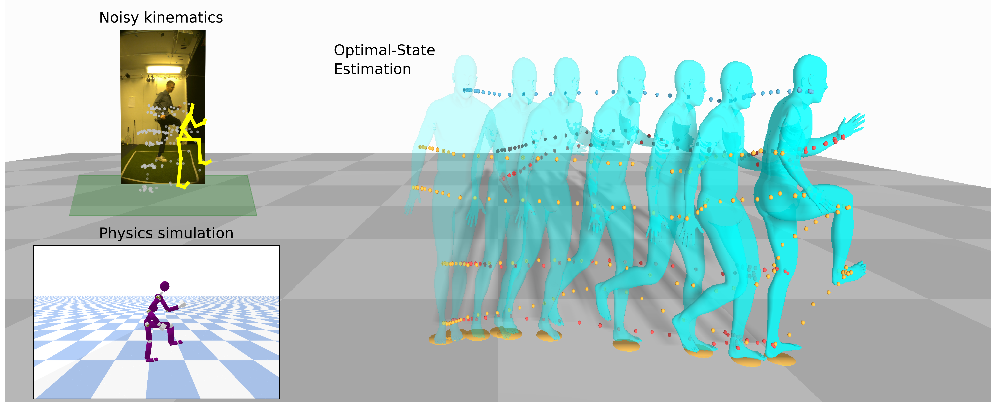

# Official Implementation of OSDCap

Optimal-State Dynamics Estimation for Physics-based Human Motion Capture from Videos

... Inprogress ...

## Dependencies

- Miniconda 23.5.2
- Python 3.8
- RBDL 3.3.1
- TRACE 

## Installation

- Install and run TRACE on a specific dataset (https://github.com/Arthur151/ROMP/tree/master/simple_romp/trace2). We recommend create a separate Conda environment to do this. Otherwise, the pre-extracted kinematics from TRACE can be download from ...

- Build and install from source RBDL with Python binding from https://github.com/rbdl/rbdl. Please refer to our instruction to install RBDL without root-privilege. 

- To install our dependencies

        pip install -r requirements.txt

## Experiments

- To generate ground truth data for Human 3.6M, transform them to friendlier format. The processed data will locate in datasets/h36m/processed/

        cd datasets/h36m/
        python process_extracted.py -p "your-h36m-directory"
        cd ../..

- To generate the training and testing database for OSDCap

        python data_gen.py -dst h36m
        python data_gen.py -dst fit3d
        python data_gen.py -dst sport

- To train the networks on a specific dataset

        python main.py -trn -dst h36m

- To test the trained models on a specific dataset

        python main -dst h36m

